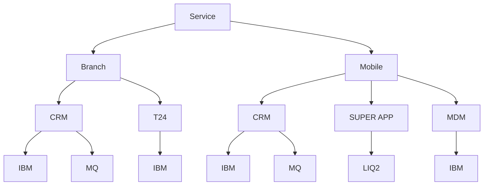

# Service Dependency Graph Requirements

## Objective

Build an interactive dependency graph that visualizes all dependencies for a selected Service.

Unlike the previous design, the graph does NOT start from Function.

The user will select a unique Service, and the graph will be generated dynamically.

Root Node:

Service

Graph hierarchy:

Service
    └── Direct Channel (DC)
            └── Application
                    └── Integration

---

## Graph Rules

- Service names are unique.
- The user selects exactly one Service.
- The selected Service becomes the root node.
- The graph is generated dynamically from the database.
- There must be no hardcoded values.

---

## Node Relationships

Each Service can have:

- One or more Direct Channels (DC)
- Each DC can have one or more Applications
- Each Application can have one or more Integrations

Example:

Service
├── Branch
│   ├── CRM
│   │   ├── IBM
│   │   └── MQ
│   │
│   └── T24
│       └── IBM
│
└── Mobile
    ├── CRM
    │   ├── IBM
    │   └── MQ
    │
    ├── SUPER APP
    │   └── LIQ2
    │
    └── MDM
        └── IBM

---

## Duplicate Applications

Applications ARE ALLOWED to appear multiple times.

Example:

Branch
└── CRM

Mobile
└── CRM

Both CRM nodes should be displayed separately.

Reason:

Although they represent the same application, they belong to different Direct Channels.

Sharing a single CRM node between Branch and Mobile would introduce multiple incoming edges, creating a spaghetti graph that is difficult to read.

The graph should therefore remain a clean hierarchical tree, even if this results in duplicated Application or Integration nodes.

Visualization clarity is preferred over node deduplication.

---

## Visualization Requirements

- Top-to-bottom tree layout.
- Root node is the selected Service.
- Children are grouped by Direct Channel.
- Expand/collapse support.
- Zoom and pan support.
- Clicking a node displays its metadata.
- Smooth animated transitions.
- Avoid crossed edges whenever possible.

---

## Future Scalability

The implementation must support:

- Unlimited Direct Channels
- Unlimited Applications
- Unlimited Integrations
- Additional dependency levels in the future

The graph should be generated entirely from the database without requiring code changes when new Services or dependency types are added.

---

## Mermaid Example

## Design Principle

Prioritize readability over node reuse.

Duplicate nodes when necessary to preserve a clean tree structure.

Avoid shared child nodes that create crossing edges and spaghetti-like diagrams.