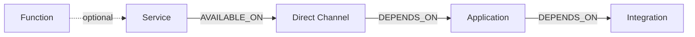
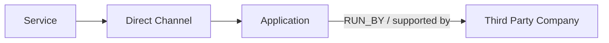
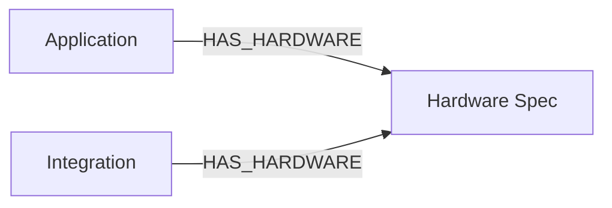
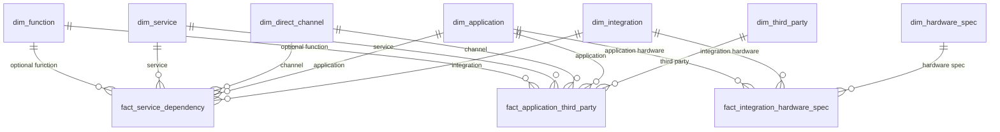
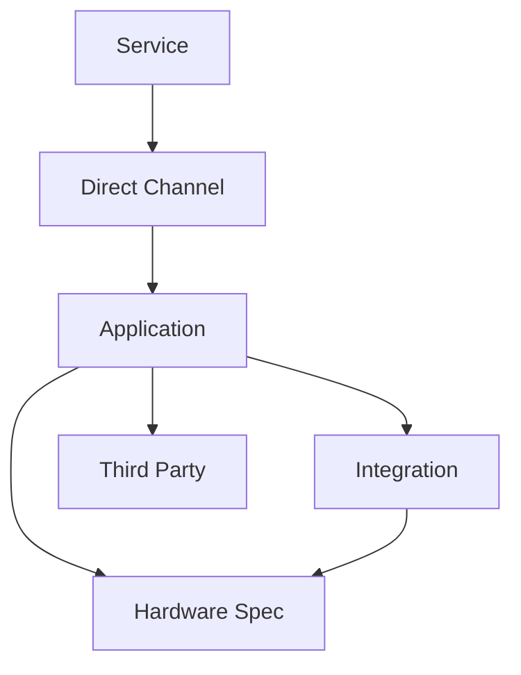

# Node Relationship Guide

This document explains how the database tables become graph nodes and relationships in the application.

## Simple Idea

The graph is built from two kinds of tables:

- `dim_*` tables are the nodes.
- `fact_*` tables are the relationships between nodes.

Example:

```text
dim_service            = Service node
dim_direct_channel     = Channel node
dim_application        = Application node
dim_integration        = Integration node
dim_third_party        = Third party node
dim_hardware_spec      = Hardware spec node

fact_service_dependency          = links service -> channel -> application -> integration
fact_application_third_party     = links application -> third party
fact_integration_hardware_spec   = links application/integration -> hardware spec
```

## Main Graph Shape

This is the main service dependency path.



Meaning:

- A service belongs to a business function when `function_id` exists.
- A service is available through one or more direct channels.
- A direct channel depends on one or more applications.
- An application depends on one or more integrations.

## Third Party Relationship

Third party companies are linked to applications.



Database table:

```text
fact_application_third_party
```

This table stores:

- which service path uses the third party
- which channel is involved
- which application is supported
- which third party company is linked

## Hardware Spec Relationship

Hardware specs can belong to either an application or an integration.



Database table:

```text
fact_integration_hardware_spec
```

Important rule:

```text
Only one of application_id or integration_id is filled.
```

So each hardware row means one of these:

```text
Application -> Hardware Spec
```

or:

```text
Integration -> Hardware Spec
```

The column `is_critical` tells if this hardware spec is critical.

## Full Table Relationship Diagram



## Tables And What They Represent

| Table | Type | Represents |
| --- | --- | --- |
| `dim_function` | Node | Business function |
| `dim_service` | Node | Service |
| `dim_direct_channel` | Node | Channel used by a service |
| `dim_application` | Node | Application used by a channel |
| `dim_integration` | Node | Integration used by an application |
| `dim_third_party` | Node | External company/vendor |
| `dim_hardware_spec` | Node | Hardware or platform spec |
| `fact_service_dependency` | Relationship | Main service path |
| `fact_application_third_party` | Relationship | Application to third party |
| `fact_integration_hardware_spec` | Relationship | Application/integration to hardware |

## Relationship Columns

### `fact_service_dependency`

This table creates the main dependency chain:

```text
Service -> Direct Channel -> Application -> Integration
```

Columns:

| Column | Points To |
| --- | --- |
| `function_id` | `dim_function.function_id` |
| `service_id` | `dim_service.service_id` |
| `direct_channel_id` | `dim_direct_channel.direct_channel_id` |
| `application_id` | `dim_application.application_id` |
| `integration_id` | `dim_integration.integration_id` |
| `is_critical` | Critical service flag |

### `fact_application_third_party`

This table creates:

```text
Application -> Third Party
```

Columns:

| Column | Points To |
| --- | --- |
| `function_id` | `dim_function.function_id` |
| `service_id` | `dim_service.service_id` |
| `direct_channel_id` | `dim_direct_channel.direct_channel_id` |
| `application_id` | `dim_application.application_id` |
| `third_party_id` | `dim_third_party.third_party_id` |

### `fact_integration_hardware_spec`

This table creates one of these two relationships:

```text
Application -> Hardware Spec
Integration -> Hardware Spec
```

Columns:

| Column | Points To |
| --- | --- |
| `application_id` | `dim_application.application_id`, nullable |
| `integration_id` | `dim_integration.integration_id`, nullable |
| `hardware_spec_id` | `dim_hardware_spec.hardware_spec_id` |
| `is_critical` | Critical hardware flag |

## How The Application Reads The Graph

The backend uses this view to read graph edges:

```text
vw_service_dependency_edges
```

That view returns rows like:

```text
source_type, source_id, source_name, target_type, target_id, target_name, relationship_type
```

Example:

```text
Service CRM -> DirectChannel Mobile
DirectChannel Mobile -> Application Middleware
Application Middleware -> Integration T24
Application Middleware -> ThirdParty IBM
Integration T24 -> HardwareSpec Oracle DB
```

## Short Summary



Read it like this:

```text
A service is used through a channel.
The channel uses an application.
The application uses integrations.
The application may have third party companies.
The application or integration may have hardware specs.
```
