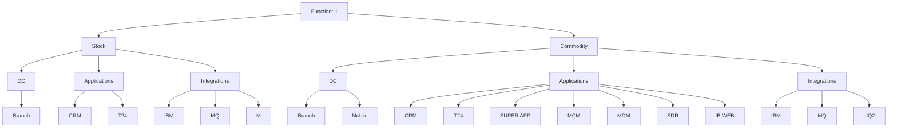

# Graph Design Requirements

## Objective

Design a dependency graph for banking services.

The graph represents the relationship between:

Function
    └── Service
            ├── Direct Channel (DC)
            ├── Application (App)
            └── Integration (Integ)

The graph is hierarchical and interactive.

---

## Current Example

There is only one Function.

Function = 1

It contains two services:

- Stock
- Commodity

The expected graph hierarchy is:

Function (1)
├── Service (Stock)
│   ├── DC
│   │   └── Branch
│   ├── Applications
│   │   ├── CRM
│   │   └── T24
│   └── Integrations
│       ├── IBM
│       ├── MQ
│       └── M
│
└── Service (Commodity)
    ├── DC
    │   ├── Branch
    │   └── Mobile
    ├── Applications
    │   ├── CRM
    │   ├── T24
    │   ├── SUPER APP
    │   ├── MCM
    │   ├── MDM
    │   ├── SDR
    │   └── IB WEB
    └── Integrations
        ├── IBM
        ├── MQ
        └── LIQ2

---

## Important Rules

- Function is always the root node.
- A Function can have multiple Services.
- Every Service owns its own dependencies.
- Dependencies are grouped into:
    - Direct Channels (DC)
    - Applications
    - Integrations
- Duplicate nodes should not be created under the same Service.
- The graph should automatically merge identical dependency names within the same Service.
- The graph should support unlimited depth for future dependency types.

---

## Visualization Requirements

- Use a top-to-bottom tree layout.
- Root node should be visually distinct.
- Services should be displayed as the second level.
- Dependency categories (DC, Applications, Integrations) should be collapsible.
- Child nodes should expand/collapse.
- Edges should be directed from parent to child.
- The graph should support zooming and panning.
- Clicking a node should display all its metadata.

---

## Expected Mermaid Example

---

## Future Scalability

The implementation must not hardcode:

- Function names
- Service names
- DC names
- Application names
- Integration names

Everything must be generated dynamically from the database.

The graph component should work regardless of the number of Functions, Services, or dependency types.